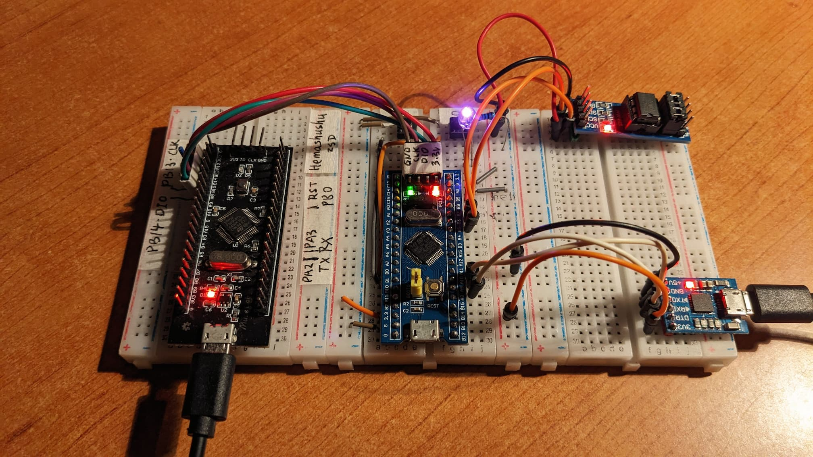

# 使用 C 编写微处理单元 (MCU）STM32F030C8T6 的 "裸机程序"

[EN](README.md) | [中文](README.zh-Hans.md)

一个用纯 C 编写的微处理单元（MCU）STM32F030C8T6/STM32F030 的 "裸机程序"，不依赖任何 IDE、SDK、HAL 或者库，也不用汇编代码，唯一需要的是 GCC 编译器。通过直接读写硬件的寄存器的方式，实现基本的输入和输出、定时器、串口通信等功能。

## 例程

- test_set_clock: PLL and SYSCLK
- test_blink: GPIO 输出
- test_button: GPIO 输入
- test_systick: SysTick
- test_uart: UART 通信
- test_button_interrupt: GPIO 中断
- test_timer: 定时器
- test_timer_interrupt: 带中断的定时器
- test_eeprom: I2C 外设
- test_dma: DMA memcpy
- test_dma_interrupt: 带中断的 DMA

[演示视频](images/stm32f030.mp4)

## 连线

- PC13: 内置 LED -
- PB9: 外接 LED +
- PB0: 按钮 0（按钮另一脚接 GND）
- PB1: 按钮 1（按钮另一脚接 GND）
- PA9: USART1_TX -> CP2012 RX
- PA10: USART1_RX -> CP2012 TX
- PB6: SCL -> EEPROM SCL
- PB7: SDA -> EEPROM SDA

## 编译

先在你的平台上安装 `arm-none-eabi-gcc`，然后运行：

`$ ./build.sh`

## 固件下载

使用 `CMSIS_DAP 调试器/下载器`（硬件）连接 MCU 到你的电脑，然后运行：

`$ ./flash.sh`

## 调试

`$ ./server-gdb-server.sh`

然后打开另一个虚拟终端（terminal）运行：

`$ ./start-gdb-client-with-svd.sh`

## 参考文档

程序当中的寄存器结构和常量来自 STM32 的硬件数据手册：

- STM32F030c8 Datasheet - production data
  https://www.st.com/resource/en/datasheet/stm32f030c8.pdf

- RM0360 Reference manual
  https://www.st.com/resource/en/reference_manual/rm0360-stm32f030x4x6x8xc-and-stm32f070x6xb-advanced-armbased-32bit-mcus-stmicroelectronics.pdf

  在章节 "AppendixA" 当中有一些简单的示例代码。

- PM0215 Programming manual
  https://www.st.com/resource/en/programming_manual/pm0215-stm32f0xxx-cortexm0-programming-manual-stmicroelectronics.pdf

感谢:

- Getting Started with Bare Metal ESP32 Programming - Vivonomicon's blog
  https://vivonomicon.com/category/stm32_baremetal_examples/
- https://github.com/cpq/bare-metal-programming-guide
- https://github.com/fcayci/stm32f4-bare-metal
- https://github.com/getoffmyhack/STM32F103-Bare-Metal
- https://github.com/ataradov/mcu-starter-projects

## Rust 语言版本

作者同时使用 Rust 语言实现了本项目，感兴趣的请点击 [MCU STM32F103C8T6 Bare-metal in Rust](https://github.com/hemashushu/practice-mcu-bare-metal-rust)
